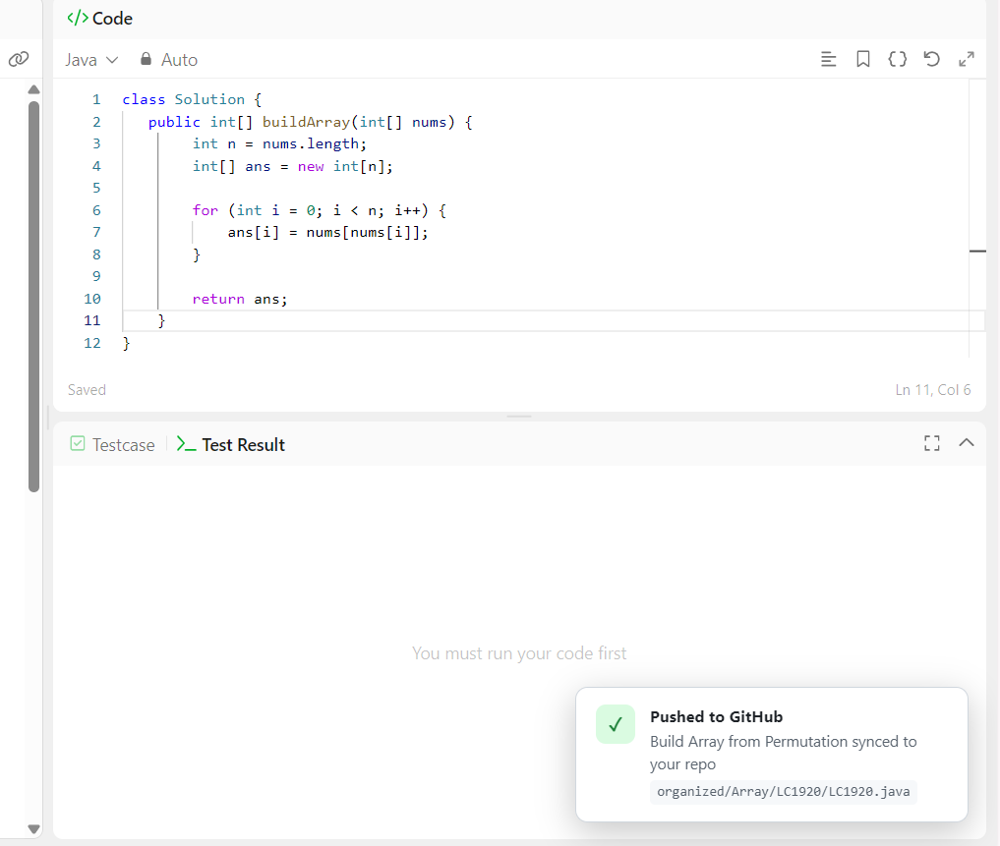
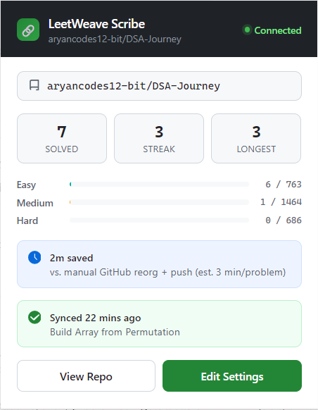
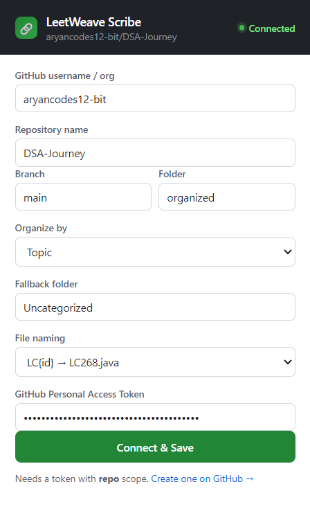
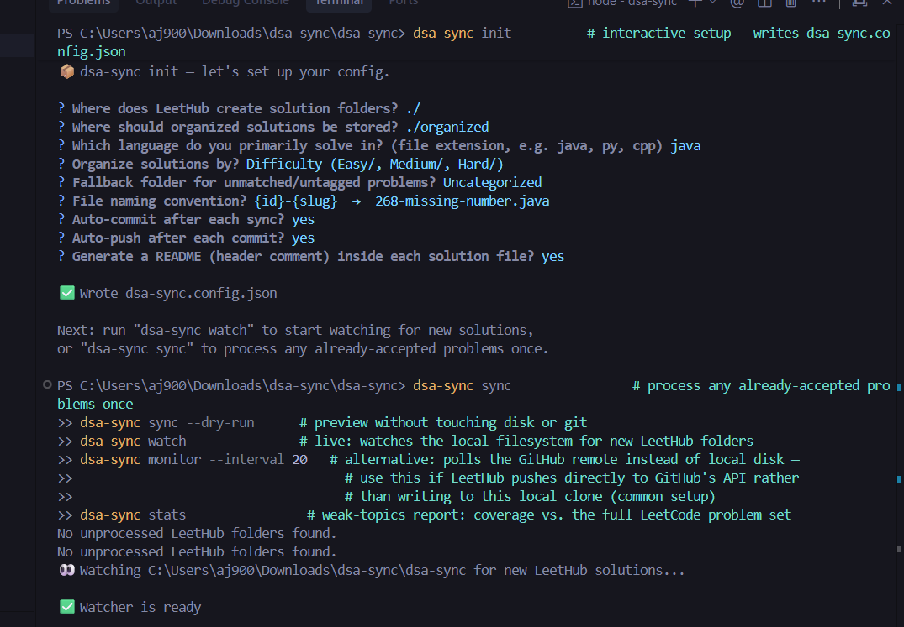
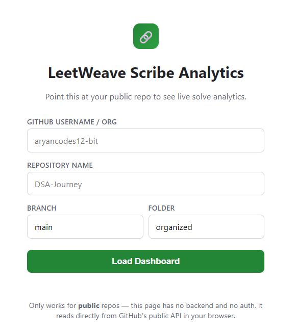
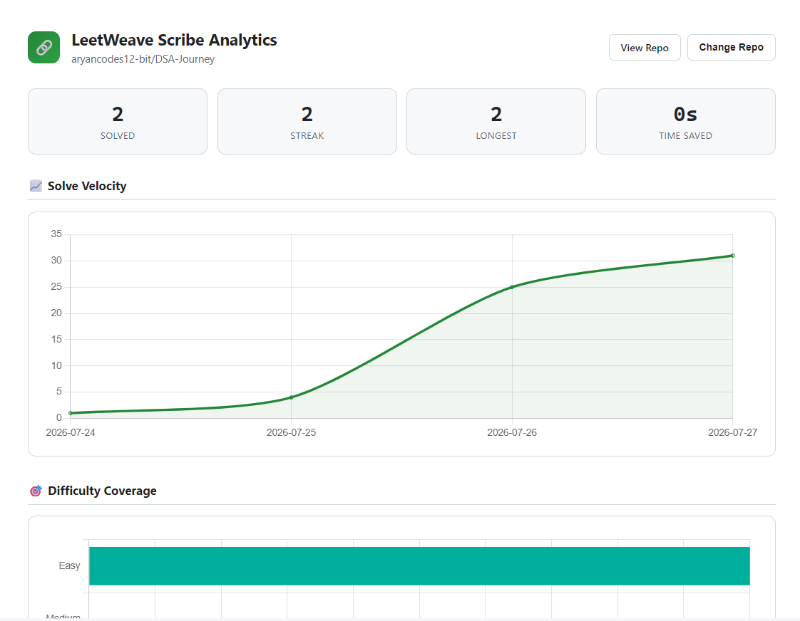
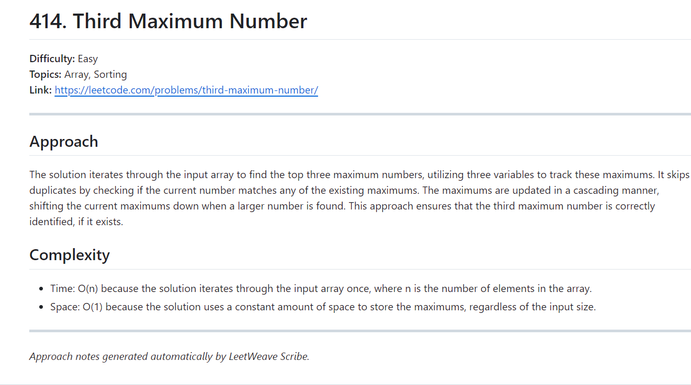

<div align="center">

# ⚡ LeetWeave Scribe

### Automatically organizes and pushes accepted LeetCode solutions to GitHub — by topic, difficulty, or a fully custom structure — with zero manual steps after setup.

[](https://developer.chrome.com/docs/extensions/mv3/intro/)
[](https://www.typescriptlang.org/)
[](https://nodejs.org/)
[](https://groq.com/)
[](LICENSE)

<p align="center">
  <a href="#-why-this-exists">Why This Exists</a> •
  <a href="#-visual-showcase">Visual Showcase</a> •
  <a href="#-recent-updates">Recent Updates</a> •
  <a href="#-architecture">Architecture</a> •
  <a href="#-tech-stack">Tech Stack</a> •
  <a href="#-running-the-extension">Extension Setup</a> •
  <a href="#-running-the-cli">CLI Setup</a> •
  <a href="#-configuration-reference">Config Reference</a>
</p>

---

</div>

## 💡 Why this exists

Most GitHub sync tools dump accepted solutions into one flat folder per problem, in submission order. That doesn't match how most people actually study — topic-based sheets, difficulty progression, custom syllabi. This project sits on top of that raw output — or replaces it entirely — and reshapes it into whatever structure you actually follow, then keeps a live stats dashboard and per-problem notes updated automatically.

Ships as two independent tools sharing one core engine: a **CLI** (`dsa-sync`) that works with any locally synced solution folder workflow, and a **browser extension** (`LeetWeave Scribe`) that detects submissions directly from the browser with zero external tool dependencies.

---

## 📸 Visual Showcase

<div align="center">

| 🚀 In-Page Toast Notification | 📊 Extension Live Dashboard |
| :---: | :---: |
|  |  |
| **⚙️ Extension Setup & Settings** | **💻 CLI Terminal Sync & Watcher** |
|  |  |
| **🔗 Analytics Dashboard — Landing** | **📈 Analytics — Velocity & Difficulty** |
|  |  |
| **🤖 Per-Problem AI README** | |
|  | |

</div>

---

## 🏗️ Architecture

```
                         ┌───────────────────────────┐
                         │   Shared "core" logic     │
                         │  (rule engine, README/stats│
                         │   generation, dataset lookup)│
                         │   — pure functions, no I/O │
                         └───────────┬───────────────┘
                     ┌───────────────┼───────────────────┐
                     │                                   │
            ┌────────▼─────────┐              ┌───────────▼──────────┐
            │   CLI (dsa-sync) │              │  Extension (LWS)     │
            │   Node.js/TS     │              │  Manifest V3         │
            └────────┬─────────┘              └───────────┬──────────┘
                     │                                    │
      ┌──────────────┼──────────────┐        ┌─────────────┼─────────────┐
      │              │              │        │             │             │
 chokidar        simple-git    git remote  content     background    Groq API
 (local watch)   (local commit/  polling    script      service       (optional,
                  push)          (monitor)  (network    worker        AI notes)
                                             interception (GitHub REST
                                             on LeetCode's  API via
                                             own API calls) fetch)
```

**Two independent detection paths, one shared brain.** The CLI watches a local git clone for new solution folders written by any sync tool; the extension intercepts LeetCode's own submission network calls directly in the browser. Both funnel into the same rule-engine logic (topic/difficulty/custom folder resolution, file naming, README templating) so a solution organized via the CLI and one organized via the extension land in identically-structured folders.

---

### 🔄 CLI data flow

```
New solution folder written locally (by any tool or manual save)
        │
        ▼
chokidar detects new folder (or `dsa-sync monitor` polls git remote)
        │
        ▼
Metadata extracted (bundled dataset lookup by problem ID, README as fallback)
        │
        ▼
Rule engine resolves destination folder + filename
        │
        ▼
File organized, original source folder cleaned up
        │
        ▼
stats.json + README.md regenerated
        │
        ▼
git add -A → commit → push (from repo root, not the destination subfolder)
```

---

### 🌐 Extension data flow

```
User submits on LeetCode
        │
        ▼
inject.ts (MAIN world) patches window.fetch, watches for the
Accepted verdict + captures the submitted code from the same request
        │
        ▼
content.ts (ISOLATED world) receives a CustomEvent, looks up problem
metadata by URL slug against the bundled dataset (no network call)
        │
        ▼
Message sent to background.ts (service worker)
        │
        ▼
Rule engine resolves destination folder + filename
        │
        ▼
GitHub Contents API (hand-rolled fetch client): push solution file,
push per-problem README.md (+ optional Groq-generated approach/complexity
section), update root stats.json + README.md
        │
        ▼
Toast shown on the LeetCode page + popup dashboard updated
```

---

## 🛠️ Tech stack

| Layer | Choice | Why |
|---|---|---|
| Language | TypeScript throughout | Shared types between CLI and extension, catches config-shape bugs at compile time |
| CLI framework | commander | Simple, no runtime dependencies beyond itself |
| CLI prompts | @inquirer/prompts | Interactive `dsa-sync init` setup |
| File watching | chokidar | Cross-platform, handles `awaitWriteFinish` debouncing natively |
| Git automation | simple-git | Wraps the real `git` binary — no reimplementing git internals |
| Config validation | zod | Runtime validation + static types generated from one schema |
| Extension bundler | esbuild (custom `build.mjs`, no framework) | Content scripts must ship as classic (non-module) IIFE bundles — esbuild's format switching handles both content-script IIFE and background/popup ESM in one build |
| GitHub API (both) | Hand-rolled `fetch` client (CLI: `simple-git` for local, extension: raw REST via `fetch`) | No SDK dependency; predictable behavior in a browser service-worker sandbox |
| AI enrichment | Groq (`llama-3.3-70b-versatile`, OpenAI-compatible endpoint) | Fast inference, generous free tier; fully optional and isolated so its failure never blocks a sync |
| Testing | Vitest (both projects) | Fast, native TS support, no config overhead |
| CI | GitHub Actions | Lint + build + test on every push, matrix across Node 18/20 |
| Data source | Bundled static dataset (~2,900 LeetCode problems: id, title, difficulty, topics), sourced from a public snapshot | Standard sync-generated READMEs do not include topic tags — this bundled dataset is the actual source of truth for organization, works fully offline |

---

## 📁 Repo structure

```
dsa-sync/                       ← CLI
├── src/
│   ├── cli/                    init, sync, watch, monitor, stats commands
│   ├── core/                   rule-engine, metadata (+ bundled dataset), organizer, readme
│   ├── config/                 zod schema + loader
│   ├── git/                    commit/push automation
│   └── data/leetcode-topics.json
├── test/
└── .github/workflows/ci.yml

LeetWeave Scribe Extension/     ← Browser extension ("LeetWeave Scribe")
├── src/
│   ├── content/                inject.ts (MAIN world), content.ts (ISOLATED world), toast UI
│   ├── background/             service worker — sync pipeline, GitHub API, Groq
│   ├── popup/                  popup.html/ts — setup form + dashboard
│   └── shared/                 rule-engine, dataset, stats, readme, github, groq, env
├── assets/                     screenshots grid media
├── build.mjs                    esbuild bundler (IIFE for content scripts, ESM for background/popup)
├── manifest.json                 Manifest V3
├── .env.example                  copy to .env for a Groq key (gitignored, never committed)
└── test/
```

---

## 🧩 Running the extension

**Requires:** Node.js 18+, Chrome (or any Chromium-based browser).

```bash
# Install dependencies
npm install
```

**Optional — AI-generated per-problem notes via Groq:**
```bash
cp .env.example .env
# open .env, add: GROQ_API_KEY=gsk_your_real_key
```
Without this, every problem still gets a basic README (title/difficulty/topics/link) automatically — this key only adds an AI-written approach + complexity section on top. It's a build-time constant, not something users enter in the popup (baked in via esbuild at build time, not stored in extension storage).

```bash
npm run build
```

### Load it into Chrome

1. Open `chrome://extensions`
2. Toggle **Developer mode** on (top-right)
3. Click **Load unpacked**
4. Select the `dist` folder — **not** the project root, the built output
5. Click the extension icon → fill in your GitHub repo details + a Personal Access Token (`repo` scope) → **Connect & Save**

### After any rebuild

Reload the extension in `chrome://extensions` (⟳ icon on the card), **and refresh any already-open LeetCode tabs** — a stale tab's content script stays bound to the old extension instance until the page reloads ("Extension context invalidated" if you skip this).

```bash
npm test           # 19 tests: rule engine, dataset lookup, Groq resilience, time-saved accumulation
npx tsc --noEmit    # typecheck
```

---

## 💻 Running the CLI

**Requires:** Node.js 18+, git installed.

```bash
cd dsa-sync
npm install
npm run build
npm link              # makes the `dsa-sync` command available globally
```

Then, inside your actual LeetCode solutions git repo:

```bash
dsa-sync init          # interactive setup — writes dsa-sync.config.json
```

Commands:

```bash
dsa-sync sync                # process any already-accepted problems once
dsa-sync sync --dry-run      # preview without touching disk or git
dsa-sync watch               # live: watches the local filesystem for new solution folders
dsa-sync monitor --interval 20   # alternative: polls the GitHub remote instead of local disk —
                                   # use this if solutions are pushed directly to GitHub's API
                                   # rather than writing to this local clone (common setup)
dsa-sync stats                # weak-topics report: coverage vs. the full LeetCode problem set
```

Dev loop (without building):
```bash
npm run dev -- init
npm test
npm run lint
```

---

## ⚙️ Configuration reference

### CLI — `dsa-sync.config.json`
```jsonc
{
  "source": "./",                    // where new solution folders appear locally
  "destination": "./organized",      // root of your organized structure
  "language": "java",
  "organization": "topic",           // "topic" | "difficulty" | "custom"
  "rules": [ { "topic": "Array", "path": "01-Arrays" } ],  // only for "custom"
  "fallbackFolder": "Uncategorized",
  "naming": { "pattern": "LC{id}" }, // also supports {slug}, {title}
  "autoCommit": true,
  "autoPush": true,
  "readme": { "generateRoot": true, "generatePerProblem": false }
}
```

### Extension — set via the popup UI, stored in `chrome.storage.local`
- GitHub repo owner / name / branch
- Destination root folder
- Organization mode + fallback folder
- File naming pattern
- GitHub Personal Access Token

Groq key is **not** part of this — it's a build-time `.env` value, not user-entered.

---

## 🧠 Notable engineering decisions

- **One core engine, two runtimes.** The rule engine, README generator, and stats logic are pure functions with zero I/O — the CLI and extension each have their own copy today (separate npm projects), but neither depends on Node-only or browser-only APIs, so behavior stays identical across both and either could import a shared package later without rewriting logic.
- **Per-problem folders, not flat files.** Each solution gets its own subfolder (`Array/LC414/LC414.java` + `Array/LC414/README.md`) rather than a flat topic folder — stays browsable at 100+ problems, and `README.md` specifically auto-renders on GitHub when the folder is opened.
- **Groq enrichment is fully isolated.** Wrapped in its own try/catch inside the sync pipeline — a bad key, rate limit, or Groq outage can never block the actual GitHub push, only skips the AI section of that one README. Verified with dedicated resilience tests (bad key, network failure, malformed response all correctly no-op rather than throw).
- **Idempotent README regeneration.** The root README is fully regenerated on every sync rather than incrementally patched, using an HTML-comment marker block — avoids drift bugs, and preserves any hand-written content a user adds outside the markers.
- **Measured, not guessed, efficiency metric.** The popup's "time saved" KPI uses a labeled estimate for the manual baseline (~3 min/problem) but subtracts *real, measured* automated sync time from it — the number is a running total built from actual data, not a one-time claim.

---

## 📝 Recent Updates

### Extension resilience & UX

- **Fixed a real "NaNs saved" bug** — popup now defensively merges cached stats with defaults instead of a plain fallback, so any stale/partial cached object (missing newer fields after an update) can never produce `NaN` in the UI again
- **Auto re-injection into already-open tabs** — the extension now re-injects its content scripts into any already-open LeetCode tab on install/update via `chrome.scripting.executeScript`, removing the "I have to reload the page" requirement that Chrome's default content-script injection model otherwise forces
- **Graceful handling of "Extension context invalidated"** — a known Chrome behavior when reloading an extension while a matching tab is already open; now surfaces a clear, actionable toast instead of a raw stack trace
- **Export/Import Settings** — added to the popup as a safety net, since a full extension reinstall (not just a reload) wipes `chrome.storage.local`, including the saved GitHub token
- **Automatic conflict retry on shared-file writes** — `stats.json` and `README.md` are touched by every single sync, making them the one place two near-simultaneous syncs can race and produce a stale sha. `putFile` now catches a 409 conflict, re-fetches the current sha, and retries once — verified with dedicated tests for the retry succeeding, a non-recoverable error (401) correctly not retrying, and the retry itself failing being correctly propagated rather than swallowed
- **Fixed an undercounting bug in folder-structure detection** — a repo mid-migration from the old flat-file layout to the new per-problem subfolder layout has both in the same topic folder; topic counting now correctly sums nested folders and distinct legacy flat-file pairs instead of only one or the other

### New: Analytics Dashboard (GitHub Pages)

- **Single dependency-free static HTML page** — no backend, no build step, no auth — reads live data directly from GitHub's public API in the browser
- **Solve velocity chart**, derived from real git commit history (not a separate tracked log)
- **Difficulty coverage and topic heatmap**, cross-referenced against the full ~2,900-problem bundled dataset for real percentages, not raw counts
- **Fixed a CDN version bug** (Chart.js pinned to a version not actually published) with a verified-working version plus an automatic fallback CDN and graceful degradation if both ever fail — stats and heatmap still render even if the chart library doesn't load

---

## 📄 License

Distributed under the **MIT License**.

---

<div align="center">
  <sub>Built with ❤️ for developers mastering Data Structures & Algorithms.</sub>
</div>
